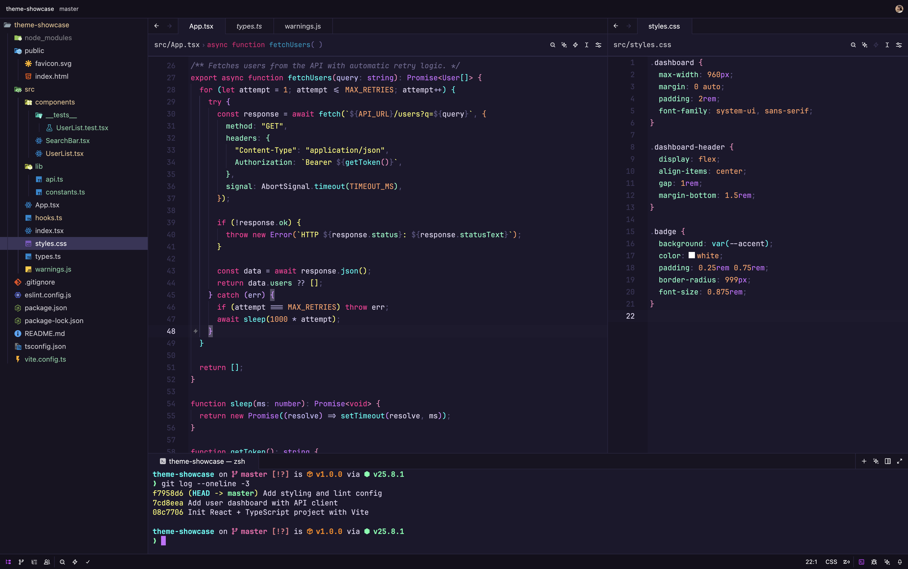
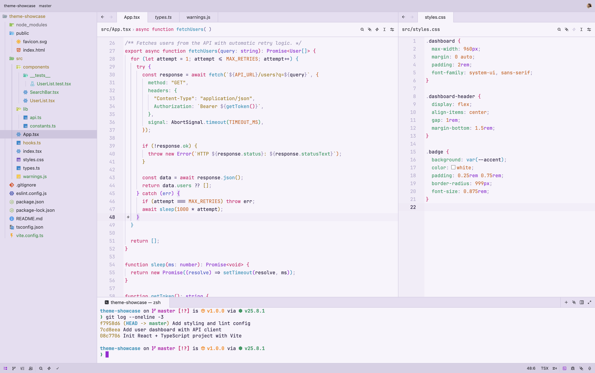

# Synthwave

A synthwave-inspired neon theme for [Zed](https://zed.dev) with dark and light variants.

## Preview

### Synthwave Neon Dark


### Synthwave Pastel Light


## Variants

- **Synthwave Neon Dark** — deep purple background with neon accents
- **Synthwave Pastel Light** — soft lavender background with saturated accents

## Syntax Colors

### Neon Dark

| Element       | Color                                                            |
| ------------- | ---------------------------------------------------------------- |
| Background    |  `#1c182c`  |
| Keywords      |  `#ff2d95`  |
| Functions     |  `#00fff5`  |
| Types         |  `#c96eff`  |
| Strings       |  `#fffe6e`  |
| Properties    |  `#80ffc8`  |
| Constants     |  `#ff9e64`  |
| Comments      |  `#6e6890`  |

### Pastel Light

| Element       | Color                                                            |
| ------------- | ---------------------------------------------------------------- |
| Background    |  `#f8f4fc`  |
| Keywords      |  `#d6196e`  |
| Functions     |  `#0090b8`  |
| Types         |  `#9528d4`  |
| Strings       |  `#a07808`  |
| Properties    |  `#109860`  |
| Constants     |  `#d06018`  |
| Comments      |  `#9a92b4`  |

## Git Status Colors

Files and folders in the sidebar are colored by git status:

| Status    | Dark                                                                | Light                                                               |
| --------- | ------------------------------------------------------------------- | ------------------------------------------------------------------- |
| Created   |  `#7ec89e`     |  `#1e8c3e`     |
| Modified  |  `#e2c08d`     |  `#a07810`     |
| Deleted   |  `#e06c75`     |  `#cc2838`     |
| Conflict  |  `#e8604a`     |  `#d04520`     |
| Ignored   |  `#7e7e84`     |  `#68666c`     |

## Install

1. Open Zed
2. Open the extensions panel (`zed: extensions` in the command palette)
3. Search for "Synthwave"
4. Click Install
5. Select the theme from `theme selector: toggle` in the command palette

## Manual install

Clone this repository into your Zed extensions directory:

```sh
git clone https://github.com/eneko-codes/synthwave-theme ~/.local/share/zed/extensions/installed/synthwave-theme
```

## License

MIT
